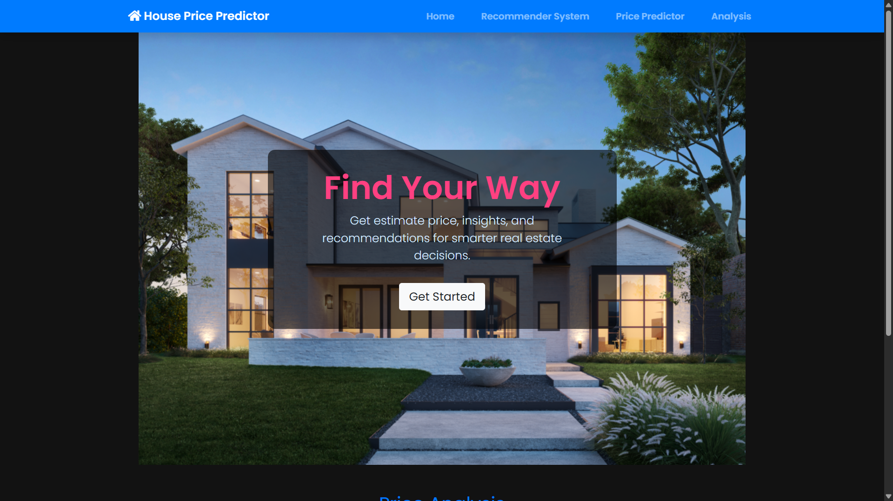
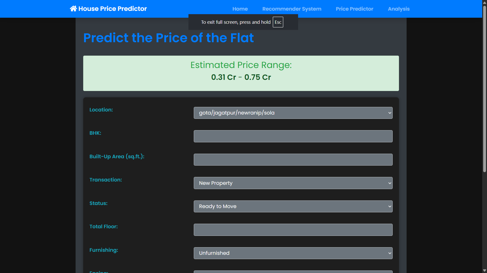
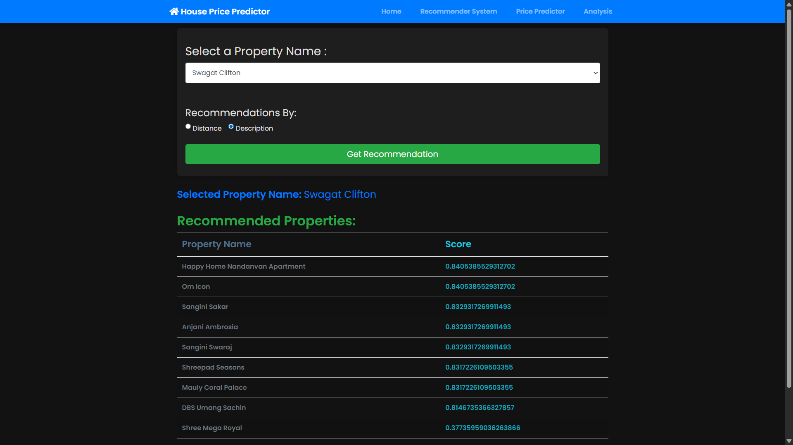
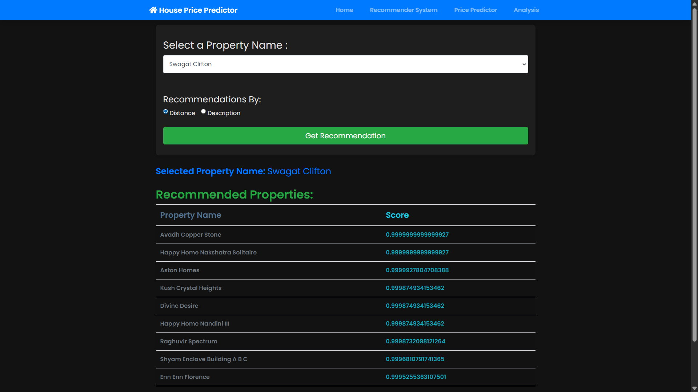
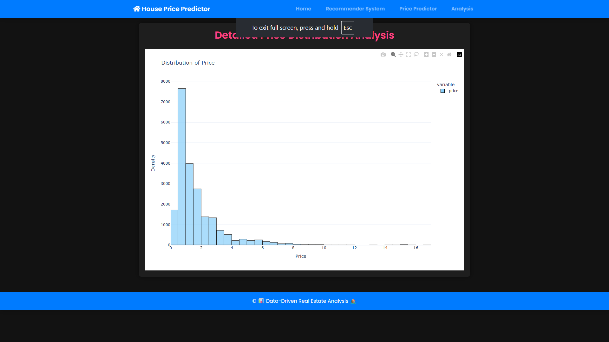
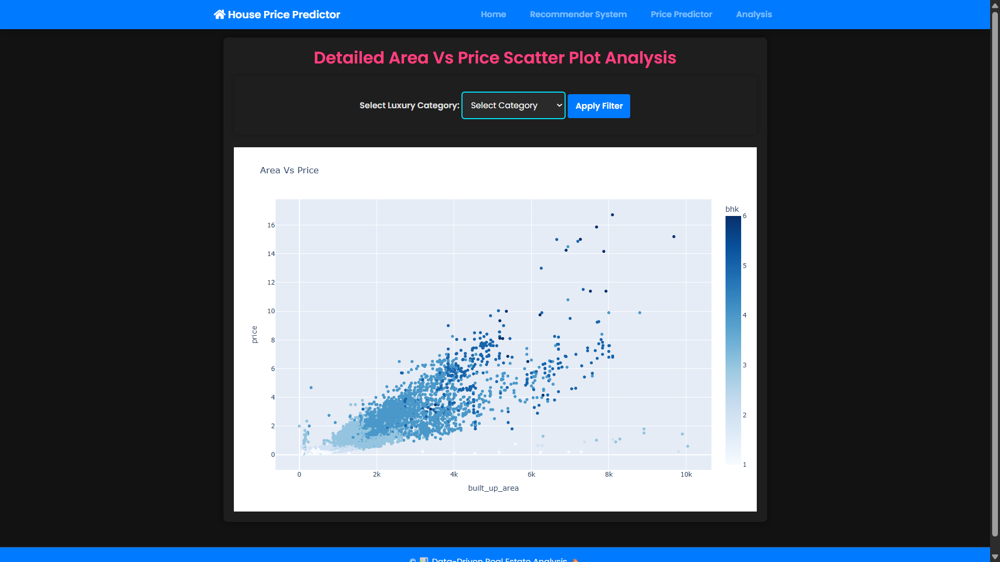
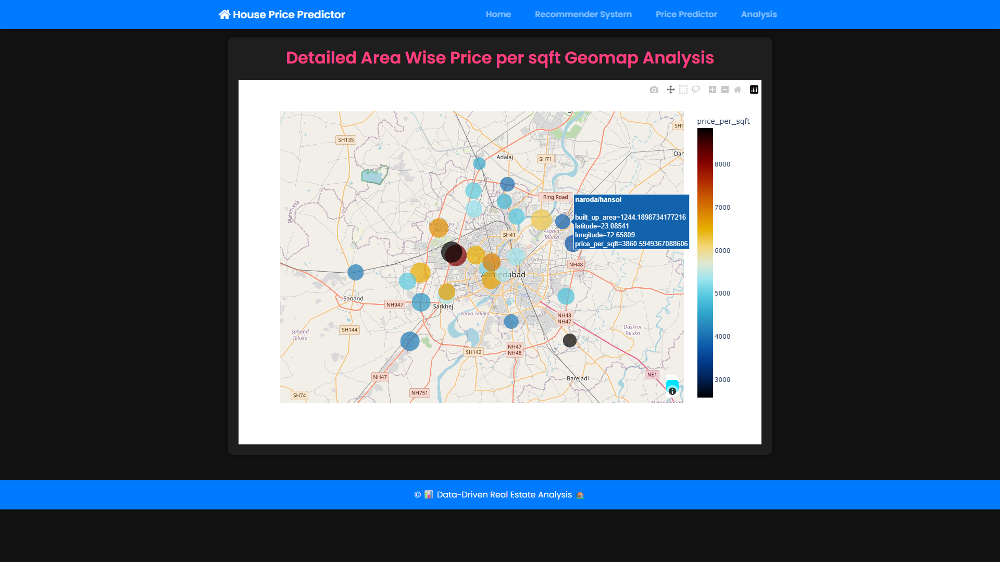
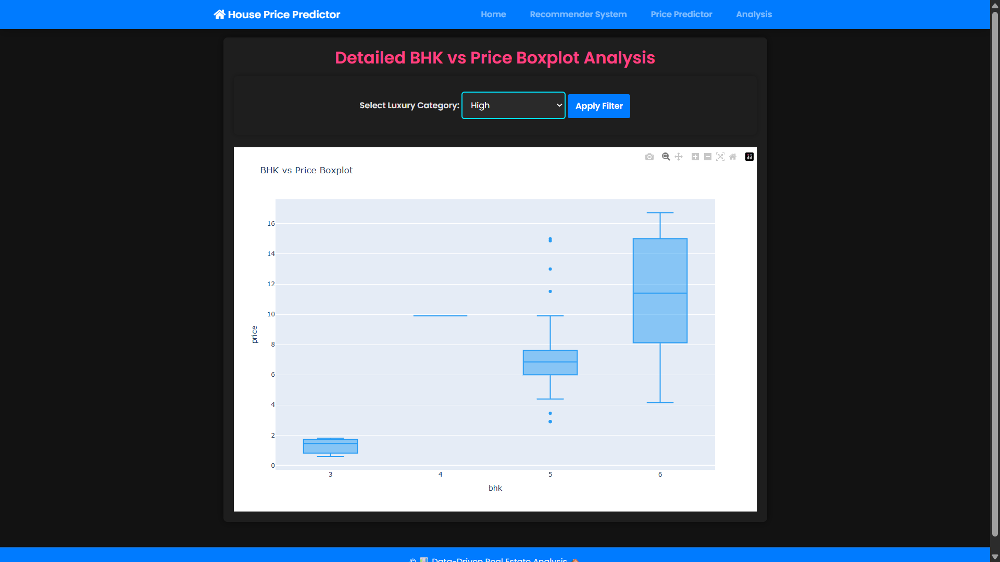

Here's a professional and detailed `README.md` file for your GitHub project: [Real-Estate-Price-Analysis](https://github.com/Prayesh13/Real-Estate-Price-Analysis). This includes a description, installation steps, usage, and highlights your implementation of the **Recommender System** using **distance** and **description** similarity.

---

### ✅ `README.md`

```markdown
# 🏘️ Real Estate Price Analysis & Recommendation System

This project is an end-to-end Real Estate Price Prediction and Property Recommendation System built using Flask, XGBoost, scikit-learn, and interactive web templates. It allows users to predict the property price based on multiple features and also explore similar properties based on two distinct recommendation strategies: **Location-based Distance Similarity** and **Description-based Text Similarity**.

---

## 🚀 Features

- 🔮 **Price Prediction** using XGBoost and feature-engineered pipeline
- 🏡 **Property Recommendation System** using:
  - 📍 **Distance-based Recommendation** (location similarity)
  - 📝 **Description-based Recommendation** (textual similarity)
- 📊 Clean UI built with Bootstrap
- 🔄 Reusable components and modular architecture
- 📁 Includes preprocessed datasets and models

---

## 📂 Project Structure

```

Real-Estate-Price-Analysis/
│
├── app.py                         # Main Flask application
├── price_prediction.py           # Prediction logic with XGBoost
├── recommendation.py             # Recommendation logic (distance & description)
├── Model/
│   └── pipeline_xgb.pkl          # Trained XGBoost pipeline model
├── datasets/
│   ├── data.joblib               # Preprocessed dataset for prediction
│   ├── location_df.joblib        # Property index for distance similarity
│   ├── desc_df.joblib            # Property index for description similarity
│   └── re_apartment.csv          # Raw/cleaned property listings
├── templates/
│   ├── layout.html               # Base template
│   ├── price_prediction.html     # Page for prediction form & output
│   ├── recommend.html            # Page for property recommendations
├── static/
│   └── css/, js/                 # (Optional) Static assets
└── README.md                     # Project documentation

````

---

## ⚙️ Installation

### 1. Clone the repository
```bash
git clone https://github.com/Prayesh13/Real-Estate-Price-Analysis.git
cd Real-Estate-Price-Analysis
````

### 2. Set up a virtual environment

```bash
python -m venv env
env\Scripts\activate      # On Windows
```

### 3. Install dependencies

```bash
pip install -r requirements.txt
```

> Note: The model is compatible with `xgboost==3.0.2` and `scikit-learn==1.5.2`. Do not change versions.

---

## 🧠 Recommender System Overview

The recommendation engine supports **two modes**:

### 📍 Distance-Based Recommendation

Uses cosine similarity on location embeddings to recommend nearby or similar locality properties.

### 📝 Description-Based Recommendation

Uses cosine similarity on TF-IDF vectorized property descriptions to recommend similar listings based on textual details.

---

## 💻 Run the Flask App

```bash
python app.py
```

Visit: [http://127.0.0.1:5000](http://127.0.0.1:5000)

---

## 📷 Screenshots











---

## 📌 Dependencies

```text
flask==2.3.3
xgboost==1.3.3
scikit-learn==1.5.2
pandas==2.2.2
numpy==1.26.4
joblib==1.4.2
category_encoders==2.6.3
matplotlib, seaborn, plotly (optional)
```

---

## ✍️ Author

**Prayesh Godhani**
📫 [GitHub](https://github.com/Prayesh13)

---

## 📃 License

This project is licensed under the MIT License. Feel free to use and modify it for personal or educational purposes.

```

---

Let me know if you'd like me to:
- Add GIF demos or screenshots
- Generate a `requirements.txt` from your environment
- Help you write deployment steps (like Render/Heroku)

Would you like me to push this to the repo directly or save it as a file?
```
